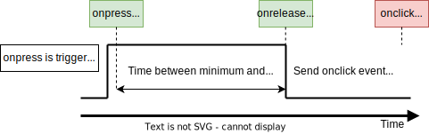
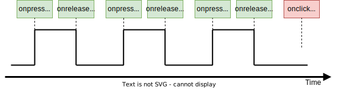

.. _um:

User manual
===========

LwBTN is simple button manager library, with great focus on embedded systems.
Motivation behind start of development was linked to several on-going projects including some input reading (button handling),
each of them demanding little differences in process.

LwBTN is therefore relatively simple and lightweight, yet it can provide pretty comprehensive processing of your application buttons.

How it works
^^^^^^^^^^^^

User must define buttons array and pass it to the library. Next to that, ``2`` more functions are required:

* Function to read the architecture button state
* Function to receive various button events

User shall later periodically call processing function with current system time as simple parameter and get ready to receive various events.

Input events
^^^^^^^^^^^^

During button (or input if you will) lifetime, application can expect some of these events (but not limited to):

* :c:enum:`LWBTN_EVT_ONPRESS` event is sent to application whenever input goes from inactive to active state and minimum debounce time passes by
* :c:enum:`LWBTN_EVT_ONRELEASE` event is sent to application whenever input sent **onpress** event prior to that and when input goes from active to inactive state
* :c:enum:`LWBTN_EVT_KEEPALIVE` event is periodically sent between **onpress** and **onrelease** events
* :c:enum:`LWBTN_EVT_ONCLICK` event is sent after **onrelease** and only if active button state was within allowed window for valid click event.

On-Press event
^^^^^^^^^^^^^^

Onpress event is the first in a row when input is detected active.
With nature of embedded systems and various buttons connected to devices, it is necessary to filter out potential noise to ignore unintential multiple presses.
This is done by checking line to be at stable level for at least some minimum time, normally called *debounce time*, usually it takes around ``20ms``.

.. figure:: ../static/images/btn-events-press.svg
    :align: center
    :alt: On-Press event trigger after minimum debounce time

    On-Press event trigger after minimum debounce time

On-Release event
^^^^^^^^^^^^^^^^

Onrelease event is triggered immediately when input goes from active to inactive state, and only if onpress event has been detected prior to that.

    On-Release event trigger

On-Click event
^^^^^^^^^^^^^^

Onclick event is triggered after a combination of multiple events:

- **Onpress** event shall be detected properly, indicating button has been pressed
- **Onrelease** event shall be detected, indicating button has been released
- Time between **onpress** and **onrelease** events has to be within time window

When conditions are met, **onclick** event is normally set after certain timeout.

    Sequence for valid click event

.. note::
    Adding a timeout feature, allows application handle **multi-onclick** events, a feature that is explained in next chapter.

Multi-click events
^^^^^^^^^^^^^^^^^^

Simplified diagram, ignoring debounce time indicators, is below.
**cp** indicates number of detected **consecutive onclick press** events, to be reported in the final **onclick** event

    Multi-click event example - with 3 consecutive presses

.. figure:: ../static/images/btn-events-click-multi-over.svg
    :align: center
    :alt: Multi-click events with too many clicks

    Multi-click events with too many clicks

Keep alive events
^^^^^^^^^^^^^^^^^
