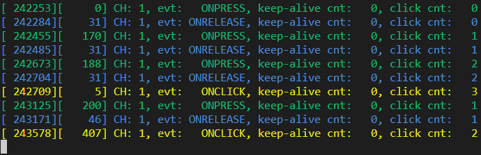

.. _um:

User manual
===========

LwBTN is simple button manager library, with great focus on embedded systems.
Motivation behind start of development was linked to several on-going projects including some input reading (button handling),
each of them demanding little differences in process.

LwBTN is therefore relatively simple and lightweight, yet it can provide pretty comprehensive processing of your application buttons.

How it works
^^^^^^^^^^^^

User must define buttons array and pass it to the library. Next to that, ``2`` more functions are required:

* Function to read the architecture button state
* Function to receive various button events

User shall later periodically call processing function with current system time as simple parameter and get ready to receive various events.

A simple example for win32 is below:

.. literalinclude:: ../../examples/example_win32.c
    :language: c
    :linenos:
    :caption: Win32 example code

Input events
^^^^^^^^^^^^

During button (or input if you will) lifetime, application can expect some of these events (but not limited to):

* :c:enum:`LWBTN_EVT_ONPRESS` event is sent to application whenever input goes from inactive to active state and minimum debounce time passes by
* :c:enum:`LWBTN_EVT_ONRELEASE` event is sent to application whenever input sent **onpress** event prior to that and when input goes from active to inactive state
* :c:enum:`LWBTN_EVT_KEEPALIVE` event is periodically sent between **onpress** and **onrelease** events
* :c:enum:`LWBTN_EVT_ONCLICK` event is sent after **onrelease** and only if active button state was within allowed window for valid click event.

On-Press event
^^^^^^^^^^^^^^

Onpress event is the first in a row when input is detected active.
With nature of embedded systems and various buttons connected to devices, it is necessary to filter out potential noise to ignore unintential multiple presses.
This is done by checking line to be at stable level for at least some minimum time, normally called *debounce time*, usually it takes around ``20ms``.

    On-Press event trigger after minimum debounce time

On-Release event
^^^^^^^^^^^^^^^^

Onrelease event is triggered immediately when input goes from active to inactive state, and only if onpress event has been detected prior to that.

.. figure:: ../static/images/btn-events-release.svg
    :align: center
    :alt: On-Release event trigger

    On-Release event trigger

On-Click event
^^^^^^^^^^^^^^

Onclick event is triggered after a combination of multiple events:

- **Onpress** event shall be detected properly, indicating button has been pressed
- **Onrelease** event shall be detected, indicating button has been released
- Time between **onpress** and **onrelease** events has to be within time window

When conditions are met, **onclick** event is sent, either immediately after **onrelease** or after certain timeout after **onrelease** event.

.. figure:: ../static/images/btn-events-click.svg
    :align: center
    :alt: Sequence for valid click event

    Sequence for valid click event

A windows-test program demonstration of events is visible below. 

.. figure:: ../static/images/log-btn-event-click.png
    :align: center
    :alt: Click event test program

    Click event test program

Second number for each line is a **milliseconds** difference between events.
OnClick is reported approximately (windows real-time issue) ``400`` ms after on-release event.

.. tip::
    Timeout window between last **onrelease** event and **onclick** event is configurable

Multi-click events
^^^^^^^^^^^^^^^^^^

Multi-click feature is where **timeout** for **onclick** event comes into play.
Idea behind timeout feature is to allow multiple presses and to only send **onclick** once for all presses,
including the number of detected presses during that time. This let's the application to react only
once with known number of presses.
This eliminates the problem where in case of **double** click trigger, you also receive **single-click** event,
while you do not know yet, if second (or third) event will be triggered after.

.. note::
    Imagine having a button that toggles one light on single click and turns off all lights in a room on double click.
    With timeout feature and single **onclick** notification, user will only receive the **onclick** once and will,
    based on the consecutive presses number value, perform appropriate action if it was single or multi click.

Simplified diagram for multi-click, ignoring debounce time indicators, is below.
**cp** indicates number of detected **consecutive onclick press** events, to be reported in the final **onclick** event

.. figure:: ../static/images/btn-events-click-multi.svg
    :align: center
    :alt: Multi-click event example - with 3 consecutive presses

    Multi-click event example - with 3 consecutive presses

A windows-test program demonstration of events is visible below. 

    Multi-click event test program

Multi-click event with **onclick** event reported only after second press after minimum timeout of ``400ms``.

.. note::
    Number of consecutive clicks can be upper-limited to the desired value.

When user makes more (or equal) consecutive clicks than maximum, an **onclick** event is sent immediately after **onrelease** event for last detected click.

    Max number of onclick events, onclick is sent immediately after onrelease

There is no need to wait timeout expiration since upper clicks limit has been reached. 

.. tip::
    It is possible to control the behavior of **onclick** event (when consecutive number reaches maximum set value) timing using :c:macro:`LWBTN_CFG_CLICK_MAX_CONSECUTIVE_SEND_IMMEDIATELY` configuration.
    When enabled, behavior is as illustrated above. When disabled, **onclick** event it sent in timeout (or in case of new onpress), even if max allowed clicks has been reached.

Illustration below shows what happens during multiple clicks

* Max number of consecutive clicks is ``3``
* User makes ``4`` consecutive clicks

.. figure:: ../static/images/btn-events-click-multi-over.svg
    :align: center
    :alt: Multi-click events with too many clicks - consecutive send immediately is enabled

    Multi-click events with too many clicks - consecutive send immediately is enabled - it is sent after 3rd onrelease

    Multi-click events with too many clicks - consecutive send immediately is disabled

Image below illustrates when send immediately is enabled. It is visible how first **onclick** is sent
just after **onrelease** event (when max consecutive is set to ``3``).

    5 presses detected with 3 set as maximum. First on-click is sent immediately, while second is sent after timeout

When **multi-click** feature is disabled, **onclick** event is sent after every valid sequence of **onpress** and **onrelease** events.

.. tip::
    If you do not want multi-click feature, set max number of consecutive clicks to ``1``. This will eliminate timeout feature since
    every click event will trigger **maximum clicks detected** and therefore send the event immediately after **onrelease**

.. figure:: ../static/images/btn-events-click-multi-disabled.svg
    :align: center
    :alt: Multi-click events disabled with cp == 1

    Multi-click events disabled with cp == 1

Demo log text, with fast pressing of button, and events reported after every **onrelease**

.. figure:: ../static/images/log-btn-event-click-disabled.png
    :align: center
    :alt: Multi-click events disabled with cp == 1

    Multi-click events disabled with cp == 1

Multi-click special case
^^^^^^^^^^^^^^^^^^^^^^^^

There is currently a special case in the library when dealing with multiclicks.
Configuration option :c:macro:`LWBTN_CFG_TIME_CLICK_MULTI_MAX` defines the maximum time between ``2`` consecutive clicks (consecutive **onrelease** events).
Timing starts with **previous** valid click. If next click event starts (that starts with **onpress** event) earlier than maximum time but ends later than maximum, then
new click is not counted as *consecutive* click to previous one.

As such, library will throw ``2`` **click** events to the user.
First one immediately on second **onrelease** event (to take care of first **onpress** and **onrelease** event group) and second one after defined user timeout.

.. note::
    Colors on picture below indicate events that relate to each other, indicated as **green** or **blue** rectangles

    Special case for multi click when timing overlaps. Orange vertical lines indicate period for valid consecutive clicks.

Keep alive event
^^^^^^^^^^^^^^^^

**Keep-alive** event is sent periodically between **onpress** and **onrelease** events.
It can be used to detect application is still alive and provides counter how many keep-alive events have been sent up to the point of event.

Feature can be used to make a trigger at specific time if button is in active state (a hold event).

.. figure:: ../static/images/btn-events-keep-alive.svg
    :align: center
    :alt: Keep alive events with 2 successful click events

    Keep alive events with 2 successful click events

    Keep alive events when button is kept pressed

Debounce
^^^^^^^^

Debouncing is a software mechanics to remove unwanted bouncing events introduced by the physical buttons.

.. tip::
    This chapter will not go into details about generic debouncing problem. 
    Have a look at `Wikipedia post about Switches <https://en.wikipedia.org/wiki/Switch>`_.

Library supports ``2`` separate debounce options:

* **Debounce on press event**: This is almost always a must-have in the application, and helps to detect valid "press" event only once after the input is in stable active state for minimum time in a row.
    
    Press event debounce can only be disabled, if application can ensure stable transition from inactive to active state. This is usually done using capacitor and resistor next to the push button (this may not be the most optimized solution for contact longevity)

* **Debounce on release event**: This is usually not necessary by most of the applications,

    but can be used in harsh environments, where unwanted external noise could affect line and put it to inactive state for short period of time (while user holds button *down* in active state).

.. note::
    Configuration settings :c:macro:`LWBTN_CFG_TIME_DEBOUNCE_PRESS` and :c:macro:`LWBTN_CFG_TIME_DEBOUNCE_RELEASE` are used to set the debounce time in milliseconds.
    When one of the values is set to ``0``, debounce feature for respective transition is not actived.

.. tip::
    Debounce time of around ``20ms`` is usually a good tradeoff between application reactivity to user events and debounce time required to stabilize the input.

Debounce examples
*****************

Examples are demonstrated using `NUCLEO-L011K4 <https://www.st.com/en/evaluation-tools/nucleo-l011k4.html>`_ board. ``2`` GPIO pins are used, one in input config, second as output.

* **Input pin (Blue)**: A raw input that acts as an user button. There is no hardware filtering. Pin is active when *low* and inactive when *high*.

* **Output pin (Red)**: Output pin is software controlled. It goes *high* on *press* event and it goes *low* on *release* event. *Press* and *release* events are reported by the library.

.. note:: 
    Logic analyzer has been connected directly to the microcontroller pins.

**Examples #1**

* :c:macro:`LWBTN_CFG_TIME_DEBOUNCE_PRESS` = ``20``
* :c:macro:`LWBTN_CFG_TIME_DEBOUNCE_RELEASE` = ``20``

    20ms debounce for press event. Press event is triggered only after input is stable in active state for minimum time.

    20ms debounce for release event. Release event is triggered only after input is stable in inactive state for minimum time.

    20ms debounce for press event - press event was not triggered - input was in stable active state for less than minimum debounce time (red line stays low).

**Examples #2**

* :c:macro:`LWBTN_CFG_TIME_DEBOUNCE_PRESS` = ``20``
* :c:macro:`LWBTN_CFG_TIME_DEBOUNCE_RELEASE` = ``0`` - release debounce is disabled

    Press event is detected after initial debounce, while release event is detected immediately on button going to inactive state.

**Examples #3**

* :c:macro:`LWBTN_CFG_TIME_DEBOUNCE_PRESS` = ``100``
* :c:macro:`LWBTN_CFG_TIME_DEBOUNCE_RELEASE` = ``100``

    100ms debounce for press event. Input bouncing is clearly visible on the diagram. Press event is triggered only after input is stable in active state for minimum time.

    100ms debounce for release event. Release event is triggered after input is in stable inactive state for at least release debounce time.

.. figure:: ../static/images/debounce-release-100ms-noise-no-event.png
    :align: center
    :class: image-with-black-border
    :alt: 100ms debounce for release event - noisy environment

    Input is in *pressed* state (red is high). Blue is in released state for less that minimum stable debounce time, therefore no *release* event has been triggered.
    This is clearly visible with the *red* line that is staying high for the whole time of the transient period.
