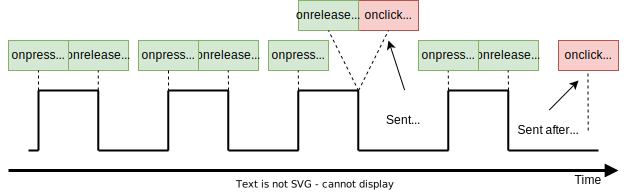
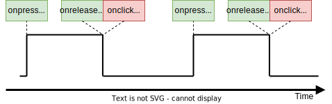

.. _um:

User manual
===========

LwBTN is simple button manager library, with great focus on embedded systems.
Motivation behind start of development was linked to several on-going projects including some input reading (button handling),
each of them demanding little differences in process.

LwBTN is therefore relatively simple and lightweight, yet it can provide pretty comprehensive processing of your application buttons.

How it works
^^^^^^^^^^^^

User must define buttons array and pass it to the library. Next to that, ``2`` more functions are required:

* Function to read the architecture button state
* Function to receive various button events

User shall later periodically call processing function with current system time as simple parameter and get ready to receive various events.

Input events
^^^^^^^^^^^^

During button (or input if you will) lifetime, application can expect some of these events (but not limited to):

* :c:enum:`LWBTN_EVT_ONPRESS` event is sent to application whenever input goes from inactive to active state and minimum debounce time passes by
* :c:enum:`LWBTN_EVT_ONRELEASE` event is sent to application whenever input sent **onpress** event prior to that and when input goes from active to inactive state
* :c:enum:`LWBTN_EVT_KEEPALIVE` event is periodically sent between **onpress** and **onrelease** events
* :c:enum:`LWBTN_EVT_ONCLICK` event is sent after **onrelease** and only if active button state was within allowed window for valid click event.

On-Press event
^^^^^^^^^^^^^^

Onpress event is the first in a row when input is detected active.
With nature of embedded systems and various buttons connected to devices, it is necessary to filter out potential noise to ignore unintential multiple presses.
This is done by checking line to be at stable level for at least some minimum time, normally called *debounce time*, usually it takes around ``20ms``.

.. figure:: ../static/images/btn-events-press.svg
    :align: center
    :alt: On-Press event trigger after minimum debounce time

    On-Press event trigger after minimum debounce time

On-Release event
^^^^^^^^^^^^^^^^

Onrelease event is triggered immediately when input goes from active to inactive state, and only if onpress event has been detected prior to that.

.. figure:: ../static/images/btn-events-release.svg
    :align: center
    :alt: On-Release event trigger

    On-Release event trigger

On-Click event
^^^^^^^^^^^^^^

Onclick event is triggered after a combination of multiple events:

- **Onpress** event shall be detected properly, indicating button has been pressed
- **Onrelease** event shall be detected, indicating button has been released
- Time between **onpress** and **onrelease** events has to be within time window

When conditions are met, **onclick** event is sent, either immediately after **onrelease** or after certain timeout after **onrelease** event.

.. figure:: ../static/images/btn-events-click.svg
    :align: center
    :alt: Sequence for valid click event

    Sequence for valid click event

A windows-test program demonstration of events is visible below. 

.. figure:: ../static/images/log-btn-event-click.png
    :align: center
    :alt: Click event test program

    Click event test program

Second number for each line is a **milliseconds** difference between events.
OnClick is reported approximately (windows real-time issue) ``400`` ms after on-release event.

Multi-click events
^^^^^^^^^^^^^^^^^^

Multi-click feature is where **timeout** for **Onclick** comes into play.
Idea behind timeout feature is to allow multiple presses and only send **onclick** once for all presses,
including the number of detected presses during that time. This let's application to react only
once with known number of presses. This eliminates the problem where in case of **double** click trigger, you also receive **single-click** event.

.. note::
    Imagine having a button that toggles one light on single click and turns off all lights in a room on double click.
    With timeout feature and single **onclick** notification, user will only receive the **onclick** once and will,
    based on the consecutive presses number value, perform appropriate action if it was single or multi click.

Simplified diagram for multi-click, ignoring debounce time indicators, is below.
**cp** indicates number of detected **consecutive onclick press** events, to be reported in the final **onclick** event

.. figure:: ../static/images/btn-events-click-multi.svg
    :align: center
    :alt: Multi-click event example - with 3 consecutive presses

    Multi-click event example - with 3 consecutive presses

A windows-test program demonstration of events is visible below. 

.. figure:: ../static/images/log-btn-event-click-multi.png
    :align: center
    :alt: Multi-click event test program

    Multi-click event test program

Multi-click event with **onclick** event reported only after second press after minimum timeout of ``400ms``.

Number of consecutive clicks can be upper-limited to the desired value.
When user makes more (or equal) consecutive clicks than maximum, an **onclick** event is sent immediately after **onrelease** event for last detected click.

.. figure:: ../static/images/log-btn-event-click-multi-max.png
    :align: center
    :alt: Max number of onclick events

    Max number of onclick events, onclick is sent immediately after onrelease

There is no need to wait timeout expiration since upper clicks limit has been reached. 
This is illustrated in the picture below, showing event sequence when:

* Max number of consecutive clicks is ``3``
* User makes ``4`` consecutive clicks

    Multi-click events with too many clicks

.. figure:: ../static/images/log-btn-event-click-multi-max-over.png
    :align: center
    :alt: 5 presses detected with 3 set as maximum

    5 presses detected with 3 set as maximum. First on-click is sent immediately, while second is sent after timeout

When **multi-click** feature is disabled, **onclick** event is sent after every valid sequence of **onpress** and **onrelease** events.

.. tip::
    If you do not want multi-click feature, set max number of consecutive clicks to ``1``. This will eliminate timeout feature since
    every click event will trigger **maximum clicks detected** and therefore send the event immediately after **onrelease**

    Multi-click events disabled with cp == 1

Keep alive event
^^^^^^^^^^^^^^^^

**Keep-alive** event is sent periodically between **onpress** and **onrelease** events.
It can be used to detect application is still alive and provides counter how many keep-alive events have been sent up to the point of event.

Feature can be used to make a trigger at specific time if button is in active state (a hold event).

    Keep alive events with 2 successful click events
